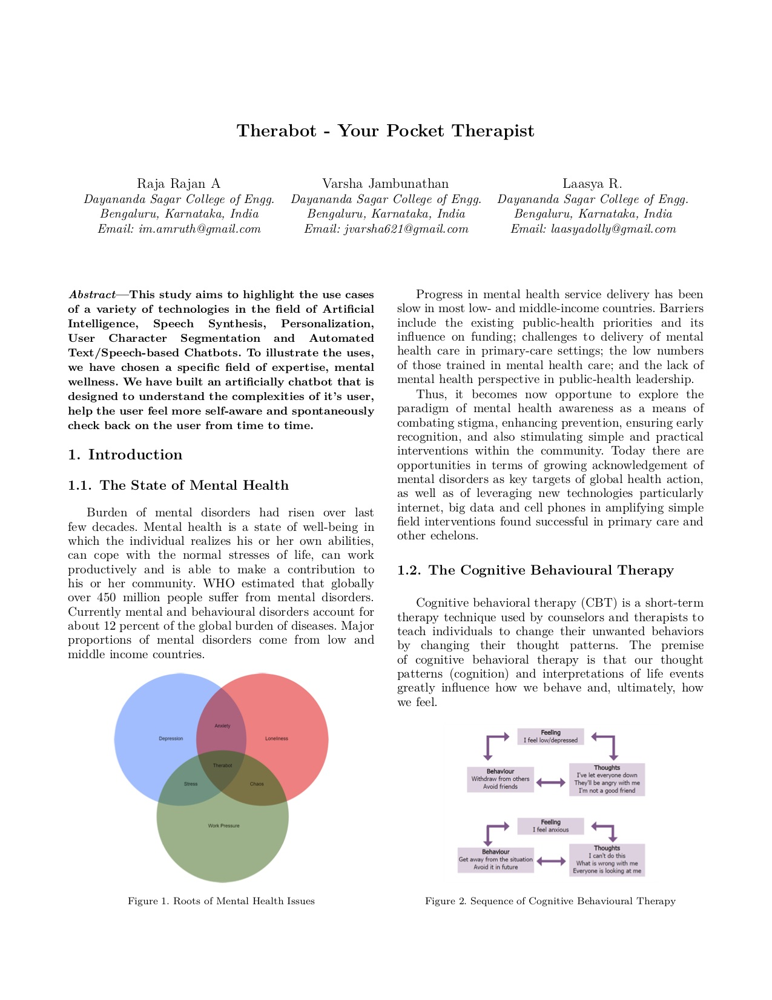

# Therabot - LaTeX Documentation
The official documentation and research paper written for **Therabot** using **LaTeX (XeTeX/LuaLaTeX + BibTeX)**.

## Preview


## Building from Source

### Prerequisites
* MikTeX (which includes XeTex/LuaLaTeX + BibTeX)
  * https://miktex.org/
* Visual Studio Code
  * https://code.visualstudio.com/
* LaTeX Workshop Extension
  * https://marketplace.visualstudio.com/items?itemName=James-Yu.latex-workshop

### Compile
* Point your terminal or command line to the repository folder, and run: `lualatex report.tex`. It will start downloading necessary packages and build your LaTeX file into a PDF.
* Run `bibtex report` to make sure all references and citations are pulled in to the repository.
* Finally, run `lualatex report.tex` once again to build the PDF along with the updated references.

#### TL;DR Version
```
cd <path-to-repo>
lualatex report.tex
bibtex report
lualatex report.tex
```

## Contributing

When contributing to this repository, please first discuss the change you wish to make via issue,
email, or any other method with the owners of this repository before making a change.

### Pull Request Process

1. Ensure any install or build dependencies are removed before the end of the layer when doing a 
   build.
2. Update the README.md with details of changes to the interface, this includes new environment 
   variables, exposed ports, useful file locations and container parameters.
3. You may merge the Pull Request in once you have the sign-off of two other developers, or if you 
   do not have permission to do that, you may request the second reviewer to merge it for you.
